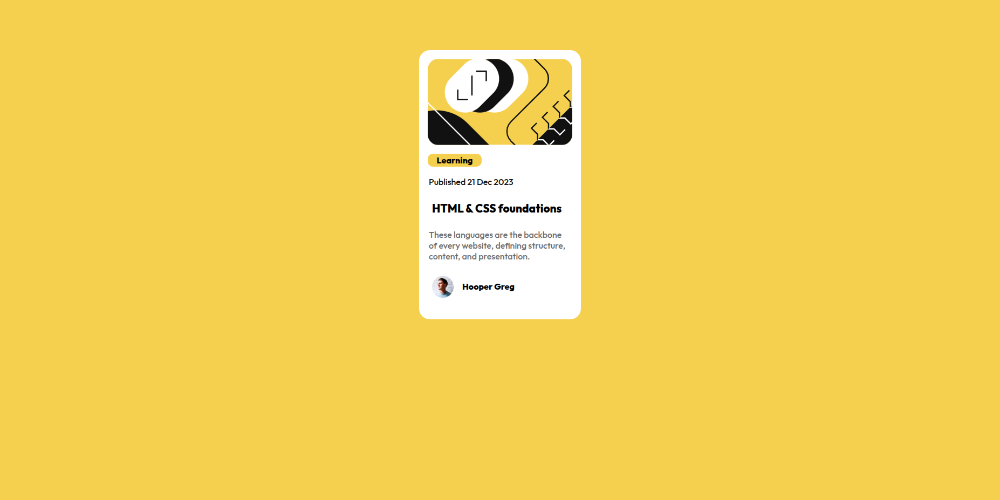

# Frontend Mentor - Blog preview card solution

This is a solution to the [Blog preview card challenge on Frontend Mentor](https://www.frontendmentor.io/challenges/blog-preview-card-ckPaj01IcS). Frontend Mentor challenges help you improve your coding skills by building realistic projects. 

## Table of contents

  - [The challenge](#the-challenge)
  - [Screenshot](#screenshot)
  - [Links](#links)
  - [Built with](#built-with)
  - [What I learned](#what-i-learned)
  - [Continued development](#continued-development)
  - [Author](#author)

### The challenge

Users should be able to:

- See hover and focus states for all interactive elements on the page

### Screenshot

### Links

- Solution URL: [https://github.com/VIN9CENT/blog-preview-card]
 Live Site URL: [https://blog-preview-card-ebhm.vercel.app/]

### Built with

- Semantic HTML5 markup
- Vanilla CSS
- Flexbox

### What I learned

I leaned how to make a responsive page without using media queries.

### Continued development

I want too continue exploring flexbox to understand it better. I also want to master css box model so that I can understand why sometimes i get horizontal scroll on the page. 

## Author

- Frontend Mentor - [@vin9cent](https://www.frontendmentor.io/profile/vin9cent)

